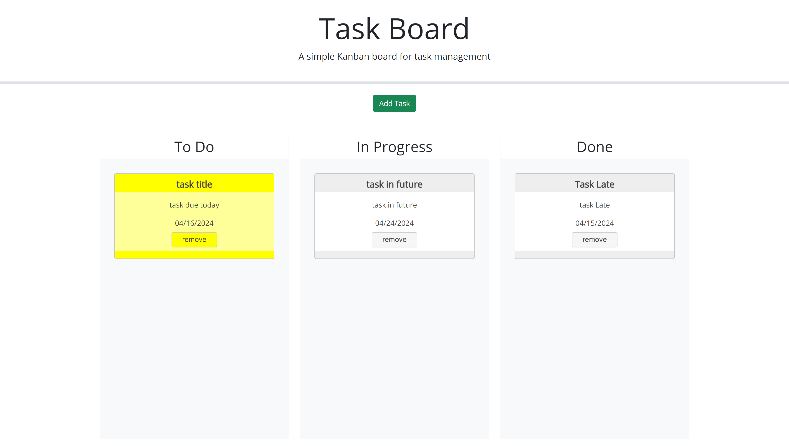

# ch06.toDoList

## Description

### User Story
A user would like to have a place to keep an ordered list of the tasks they need to accomplish. The user would like to be able to order the tasks according to whether or not they are in progress, done or still need to be done. The user wants visual indicators to display the urgency of a task based on its due date and whether or not it has been done. The user wants to be able to return to the task list whithout having to re-enter the task data. The user would like the ability to remove a task from the list.

### Challenge Overview
The primary focus of this challenge was dynamically creating elements whose styles could be changed based on external information (user date input and the elements page location). The primary hurddle was setting up a more indepth styling rule system then just using classes, attributes and generic ids in the manner we have in the past.
This challenge also focused on using third party libraries like bootstrap, day.js and jquery with all js coding being done according to jquery's notation rules.  

## Usage

Here is a [link to the webpage](https://rozierhj.github.io/ch06.toDoList/)

This is what the web page should like like when this challenge is complete.

Project Modal

Styled Task Cards
 

Local Storage
 

A video of [The Webpage in action](https://app.screencastify.com/v3/watch/0eB0EN5LUS0mA2pugz3n)